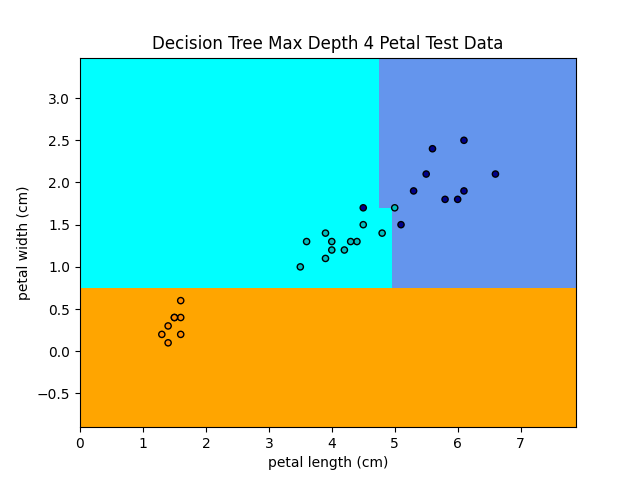
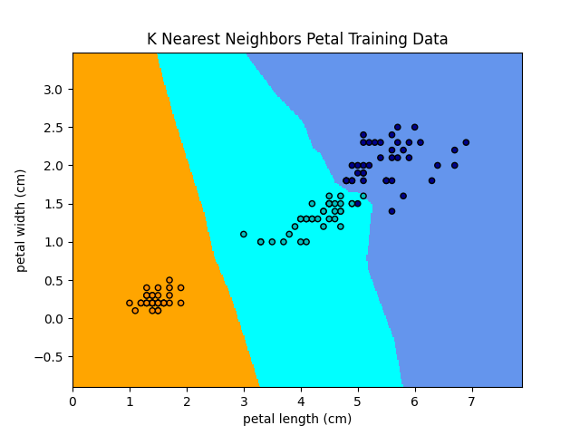
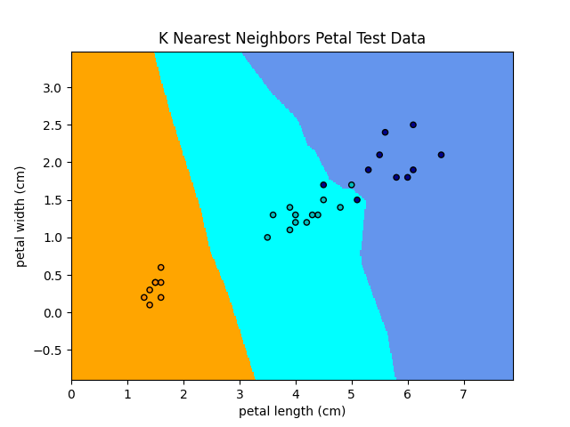
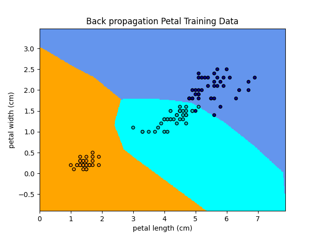
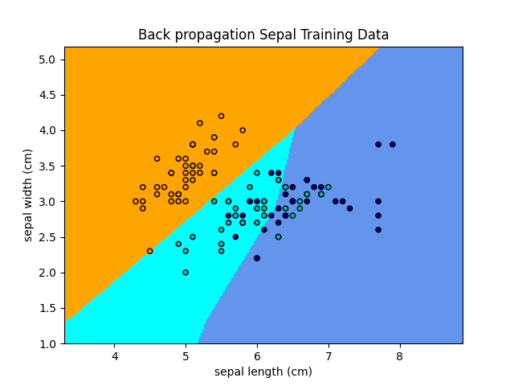
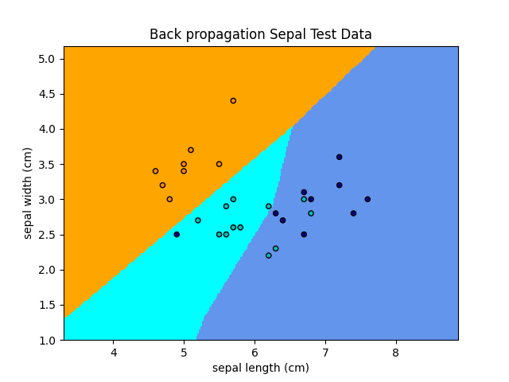

# Machine Learning Algorithms

The goal of this project is to comapre different machine learning algorithms for different problems. Part A of this application focuses on using the Iris dataset to compare classification algorithms. Part B of this project focuses on different implementations of gradient decent.

## Part A - Classification Algorithms

_Two to three pages_

### What you did

Part A of this project was designed to teach about different classification algorithms. Several different classification algorithms were used on the famous Iris dataset to predict the species of an Iris given the sepal width, sepal length, petal width, and petal length. These classification algorithms include the decision tree, k-nearest neighbors, neural networks through backpropagation, and k-means clustering algorithms. These algorithms were implemented through [Scikit-learn](https://scikit-learn.org/stable/index.html).</br>

This project was developed using [Python 3.7.7](https://www.python.org/downloads/release/python-370/) and [Scikit-Learn](https://scikit-learn.org/stable/index.html). Additionally, the machine used to build and run the code is running MacOs Mojave (v10.14.6).</br>

The Iris dataset is comprised of 150 samples, and each sample records the width and length of both the petal and sepal. To visualize these samples, two graphs were created: one comparing petal width and length, the other comparing sepal width and length. The following images show these relationships and the categorization of each data point.</br>

|Petal                                                                          |Sepal                                                                      |
|:-----------------------------------------------------------------------------:|:-------------------------------------------------------------------------:|
|     |  |

On these graphs, it is important to note that datapoints of different categories can overlap. For instance, there are two datapoints at sepal length 5.9 and sepal width 3, but one is categorized as versicolor and the other virginica. Taken without the petal length and width, it is impossible to distinguish these two points into seperate categories. </br>

For each algorithm, the Iris data set was split into test data and training data using the ```train_test_split``` method from SciKit-Learn. Twenty percent of samples were saved for testing data. The other samples were used for training data. Next the models were fit to the training data, and test samples were passed in to check for accuracy. To better visualize the results of these algorithms, the models were then fit to petal data and sepal data independently and graphed.

### Results

_Which classification learning algorithm performed best?_
*For the graphs in this section, orange represents sentosa, cyan represents versicolor, and blue represents virginica.*

**Decision Tree Learning** The first algorithm implemented in this application was decision tree learning. Decision tree learning is a type of supervised learning where the samples are split based on the value of attributes in order to classify each sample. In general, simpler trees are better than complex ones because they tend to generalize the problem better, and choosing the correct attributes can lead to simpler trees. Fitting the tree with the training data and all four attributes (petal width and height and sepal width and height) produced the following tree. Decision nodes begin with a constraint. For example, the root node begins with ```X[2] <= 2.45```. Leaf nodes show the total number of samples in each category. For instance, of the training data with a petal length of less than or equal to 2.45, all 42 samples were in the first category, sentosa. This tree shows how attributes can be used to categorize data.</br>

</br>

In order to visualize the effectiveness of the decision tree aglorithm on this data set, the attributes were divided between petal and sepal and plotted on a graph. The shaded regions represent the category boundaries created by the AI, and the data points are actual data points in the training set. A max depth for this tree was not specified. They show that the training data properly categorizes almost all of the training data, but decision trees can often overfit data. In the sepal graphs, there is a virginica classification pocket between a width of 5.5 to 6.2 and a height of 2.4 to 2.6. The training data is properly catorgized, but the test data is categorized incorrectly.</br>

|Max Depth  |Training Samples                                                            |Test Samples                                                               |
|-----------|:--------------------------------------------------------------------------:|:-------------------------------------------------------------------------:|
|None       |      | |
|None       |      | |

Because simpler trees can often generalize data better than complex ones, specifying a max depth can often help avoid overffiting the data. The following graphs show the categorization of decision trees with a max depth of four. This decision tree still preforms well for petal data, and preforms better than the original decision tree for sepal samples</br>

|Max Depth  |Training Samples                                                            |Test Samples                                                               |
|-----------|:--------------------------------------------------------------------------:|:-------------------------------------------------------------------------:|
|4          || |
|4          || |

**K-nearest Neighbors**   </br>

|Training Samples                                                                 |Test Samples                                                                   |
|:-------------------------------------------------------------------------------:|:-----------------------------------------------------------------------------:|
| | |
| | |

**K-means Clustering**   </br>

|Training Samples                                                                 |Test Samples                                                                   |
|:-------------------------------------------------------------------------------:|:-----------------------------------------------------------------------------:|
|   |   |
|   |   |

**Back-propagation**   </br>

|Training Samples                                                                 |Test Samples                                                                   |
|:-------------------------------------------------------------------------------:|:-----------------------------------------------------------------------------:|
|     |     |
|     |     |

|Algorithm                      |Training Accuracy              |Test Accuracy                  |Classification report          |
|-------------------------------|-------------------------------|-------------------------------|-------------------------------|
|Decision Tree                  |0.950000                       |0.900000                       |90%                            |
|Decision Tree Max Depth 4      |0.950000                       |0.933333                       |93%                            |
|K Nearest Neighbors            |0.958333                       |0.933333                       |93%                            |
|Back propagation               |0.975000                       |0.966667                       |97%                            |

### Lessons Learned

### Digit Data Comparison

## Part B - Gradient Decent

_Two pages_

### What you did

### Results

Compare the training time and final performance of the neural networks trained using these three variants of gradient descent and report your results using at least one graph.

### Analysis

Include a description of the neural network you trained: how many hidden layers and hidden units, how many input and output nodes, and the details of the learning algorithm (learning rate, momentum).