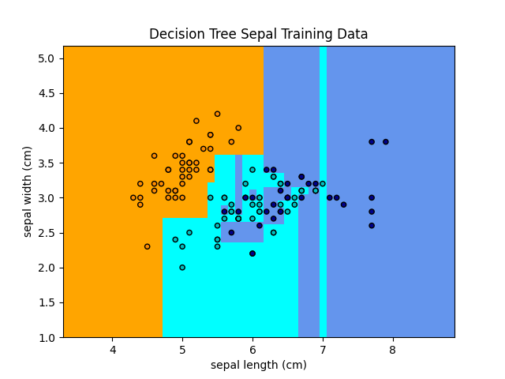
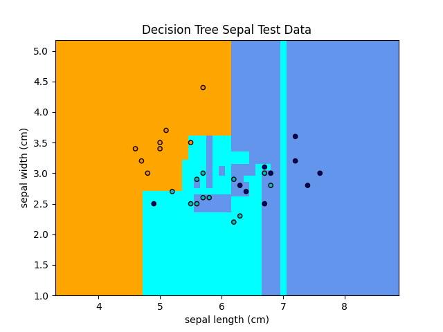
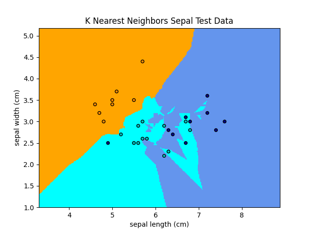
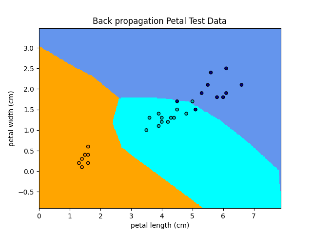
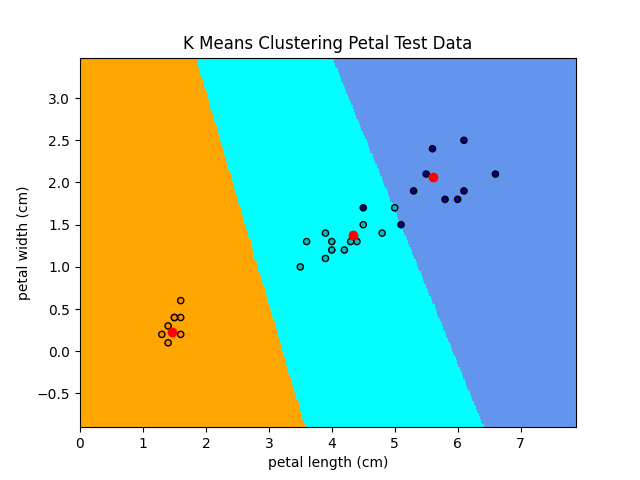
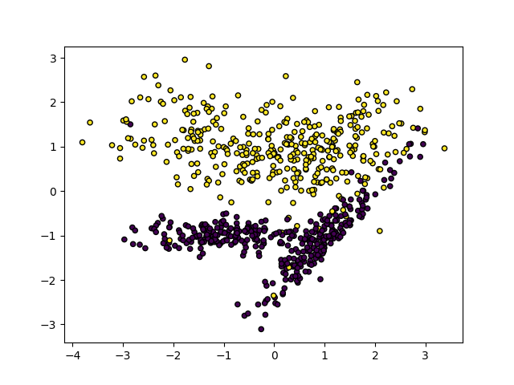
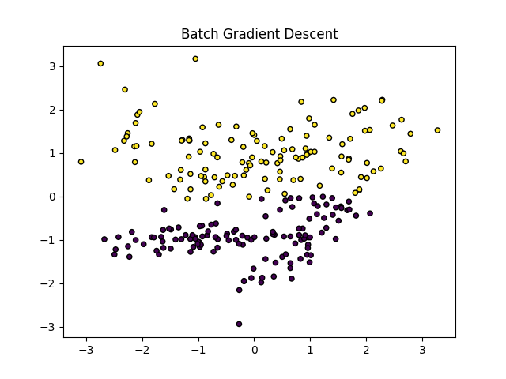
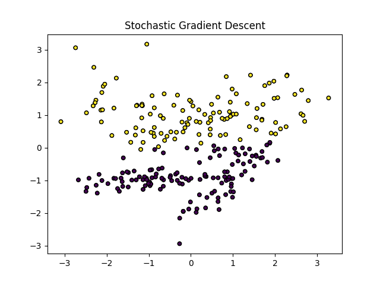
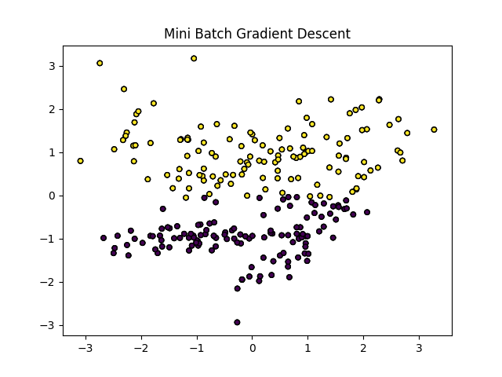

# Machine Learning Algorithms

The goal of this project is to compare different machine learning algorithms for different problems. Part A of this application focuses on using the Iris dataset to compare classification algorithms. Part B of this project focuses on different implementations of gradient decent.</br>

This project was developed using [Python 3.7.7](https://www.python.org/downloads/release/python-370/) and [Scikit-Learn](https://scikit-learn.org/stable/index.html). Additionally, the machine used to build and run the code is running MacOs Mojave (v10.14.6).</br>

## Part A - Classification Algorithms

_Two to three pages_

### Implementation

Part A of this project was designed to teach about different classification algorithms. Several different classification algorithms were used on the famous Iris dataset to predict the species of an Iris given the sepal width, sepal length, petal width, and petal length. These classification algorithms include the decision tree, k-nearest neighbors, neural networks through backpropagation, and k-means clustering algorithms. These algorithms were implemented through [Scikit-learn](https://scikit-learn.org/stable/index.html).</br>

The Iris dataset is comprised of 150 samples, and each sample records the width and length of both the petal and sepal. To visualize these samples, two graphs were created: one comparing petal width and length, the other comparing sepal width and length. The following images show these relationships and the categorization of each data point.</br>

|Petal                                                                          |Sepal                                                                      |
|:-----------------------------------------------------------------------------:|:-------------------------------------------------------------------------:|
|     |  |

On these graphs, it is important to note that datapoints of different categories can overlap. For instance, there are two datapoints at sepal length 5.9 and sepal width 3, but one is categorized as Versicolor and the other Virginica. Taken without the petal length and width, it is impossible to distinguish these two points into separate categories. </br>

For each algorithm, the Iris data set was split into test data and training data using the ```train_test_split``` method from SciKit-Learn. Twenty percent of samples were saved for testing data. The other samples were used for training data. Next the models were fit to the training data, and test samples were passed in to check for accuracy. To better visualize the results of these algorithms, the models were then fit to petal data and sepal data independently and graphed.

### Results

_Which classification learning algorithm performed best?_</br>
*For the graphs in this section, orange represents Sentosa, cyan represents Versicolor, and blue represents Virginica.*

**Decision Tree Learning** The first algorithm implemented in this application was decision tree learning. Decision tree learning is a type of supervised learning where the samples are split based on the value of attributes in order to classify each sample. In general, simpler trees are better than complex ones because they tend to generalize the problem better, and choosing the correct attributes can lead to simpler trees. Fitting the tree with the training data and all four attributes (petal width and height and sepal width and height) produced the following tree. Decision nodes begin with a constraint. For example, the root node begins with ```X[2] <= 2.45```. Leaf nodes show the total number of samples in each category. Of the training data with a petal length of less than or equal to 2.45, all 42 samples were in the first category, Sentosa. This tree shows how attributes can be used to categorize data.</br>

</br>

In order to visualize the effectiveness of the decision tree algorithm on this data set, the attributes were divided between petal and sepal and plotted on a graph. The shaded regions represent the category boundaries created by the AI, and the data points are actual data points in the dataset. A max depth for this tree was not specified. These graphs show that most of the training data is categorized correctly, but some of the data was overfit. In the sepal graphs, there is a Virginica classification pocket between a width of 5.5 to 6.2 and a height of 2.4 to 2.6. The training data is properly categorized, but the test data is categorized incorrectly.</br>

|Max Depth  |Training Samples                                                            |Test Samples                                                               |
|-----------|:--------------------------------------------------------------------------:|:-------------------------------------------------------------------------:|
|None       |      | |
|None       |      | |

Because simpler trees can often generalize data better than complex ones, specifying a max depth can often help avoid overfitting the data. The following graphs show the categorization of decision trees with a max depth of four. A negative side effect of specifying a max depth is that a tree can be too simple and not be able to properly classify data. It is important to find a balance of simplicity. This decision tree still performs well for petal data and performs better than the original decision tree for sepal samples.</br>

|Max Depth  |Training Samples                                                            |Test Samples                                                               |
|-----------|:--------------------------------------------------------------------------:|:-------------------------------------------------------------------------:|
|4          || |
|4          || |

**K-nearest Neighbors** The second algorithm implemented in this application was the k-nearest neighbors algorithm. This is another form of supervised learning. In this algorithm, new data is compared to its k closest neighbors and classified according to the majority. Modifying the ```k``` value helps find a balance between over-fitting and under-fitting. If the ```k``` value is too small, this algorithm tends to overfit data. On the other hand, if the ```k``` value is too large, it can lead to underfitting. In these examples, ```k``` is set to 3, so the algorithm searches for the closest 3 datapoints to categorize data. This algorithm performs much better than the decision tree algorithm and is less prone to overfitting the data. It still performs better than on the petal data than the sepal data. </br>

|Training Samples                                                                 |Test Samples                                                                   |
|:-------------------------------------------------------------------------------:|:-----------------------------------------------------------------------------:|
| | |
| | |

**Back-propagation** The third classification method used in this project was a neural network using back-propagation techniques for adjusting weights. This is another supervised classification algorithm. In a gist, a neural network is created with a set of layers of neurons. There are input layers, output layers and hidden layers. Each neuron has a set of inputs (or dendrites) that map to an output (or axon). Each input of a neuron has an associated weight, and these weights are updated during the back-propagation step. The output of a neuron is the sum of inputs multiplied by their weights passed through an activation function. The neural network created in this application makes use of the Sci-Kit tools. The following graphs show the effectiveness of this technique. Overall, there are less errors than found with decision trees and k-nearest-neighbors. Neural networks are effective for both known and unknown samples.</br>

|Training Samples                                                                 |Test Samples                                                                   |
|:-------------------------------------------------------------------------------:|:-----------------------------------------------------------------------------:|
|     |     |
|     |     |

**All Together** These algorithms were analyzed for their effectiveness and accuracy. This chart shows the performance of each of these algorithms. It was found that back-propagation was by far the best technique to use. It performed the best for both the training and test datasets. This shows that the back-propagation model was less likely to overfit or underfit data. K-nearest-neighbors and a decision tree with a max depth of 4 performed similarly, but K-nearest-neighbors better classified the training data. The decision tree without a max depth shows signs of over-fitting data. This means that it performed better well on the training data, but poorly for the test data. If interested, the full output of this application is located in [metricsA.txt](metricsA.txt). </br>

|Algorithm                      |Training Accuracy              |Test Accuracy                  |Classification report          |
|-------------------------------|-------------------------------|-------------------------------|-------------------------------|
|Decision Tree                  |0.950000                       |0.900000                       |90%                            |
|Decision Tree Max Depth 4      |0.950000                       |0.933333                       |93%                            |
|K Nearest Neighbors            |0.958333                       |0.933333                       |93%                            |
|Back-propagation               |0.975000                       |0.966667                       |97%                            |

**K-means Clustering** Additionally, the k-means clustering algorithm was also applied to the Iris dataset. Unlike the other examples, this algorithm is unsupervised. This means that the training data passed in does not include the categories the training data belong to. Instead of using known categories of the data, this algorithm defines its own categories. In k-means clustering, k refers to the number of clusters created and k centroids. This algorithm has two steps. The first is to assign datapoints to a centroid (usually using Euclidean distance).The second is to update the centroid to be in the center of all of its assigned datapoints. When the clusters stop moving and datapoints stop switching categories, the algorithm is complete. When preforming this algorithm on the Iris dataset, it works surprisingly well for petal data, and has a few errors with sepal data. The centroid of each category is shown in red on the graphs. This algorithm is interesting because it shows that the categories can be derived even without the knowledge that the categories exist.</br>

|Training Samples                                                                 |Test Samples                                                                   |
|:-------------------------------------------------------------------------------:|:-----------------------------------------------------------------------------:|
|   |   |
|   |   |

### Digit Data Comparison

These algorithms can be applied to many classification problems. A similar dataset to the Iris dataset is the digits dataset. This dataset has images of handwritten digits. The idea is to take the pixels of a sample and determine which digit it is. This can be done using the same supervised learning techniques. When applied to these samples, the following output was recorded. </br>

|Algorithm                      |Training Accuracy              |Test Accuracy                  |Classification report          |
|-------------------------------|-------------------------------|-------------------------------|-------------------------------|
|Decision Tree                  |0.850350                       |0.841667                       |84%                            |
|Decision Tree Max Depth 4      |0.553948                       |0.566667                       |57%                            |
|K Nearest Neighbors            |0.988160                       |0.986111                       |99%                            |
|Back-propagation               |0.929706                       |0.930556                       |93%                            |

These results are interesting when comparing them to the results of the Iris dataset. For the digits dataset, k nearest neighbors performed much better than any of the other algorithms. The decision tree with a max depth of 4 was not complex enough to classify even the training data. Though back-propagation has a high accuracy, it ultimately consistently performs worse than k nearest neighbors. Adjusting the learning rate and possibly the learning function could help improve the back-propagation algorithm. If interested, the full output of this application is located in [metricsAExtraCredit.txt](metricsAExtraCredit.txt).

### Biggest Takeaways

This project has helped provide an understanding of different machine learning classification algorithms. For the Iris dataset, back-propagation clearly performed better than any other algorithm, but the others have their merits too. Where neural networks and back-propagation are not intuitive, decision trees are easy to understand and conceptualize. Decision trees have the downside of being more prone to over-fitting than other algorithms. Specifying a max depth could either greatly improve or hinder the performance of the algorithm. For the Iris dataset, the limitation increased accuracy, but for the digits dataset, it drastically decreased it. K-nearest-neighbors is helpful when considering the proximity between multiple data points but is also really slow computationally. Choosing a proper value for ```k``` is the best way to avoid over-fitting or under-fitting. For the digits dataset, k nearest neighbors preformed beautifully.</br>

## Part B - Gradient Decent

_Two pages_

### Implementation

Part B was designed to increase the understanding of gradient descent and different implementations of gradient descent. Gradient descent is the common method used to adjust input weights in neural networks. There are three different variants: batch, stochastic, and mini-batch. The main premise of each of these is the same. The idea is to propagate forward through the neural network, determine the error of the output, and propagate backwards through the network to adjust the weights of the network based on this error. Batch, stochastic, and mini-batch gradient descent vary on the size of the data being tested. For batch gradient descent, the entire dataset is passed through the neural network at each iteration. This is exceedingly slow for very large datasets, but produces a stable learning curve. For stochastic gradient descent, only one random sample is tested at each iteration. Stochastic gradient descent is faster, but it is less stable. Mini-batch combines batch and stochastic gradient descent to test a portion of the data at each iteration. It bridges the advantages and disadvantages between batch and stochastic gradient descent</br>

For the implementation of these variants, code from [Agustinus Kristiadi](https://wiseodd.github.io/techblog/2016/06/21/nn-sgd/) was used and modified slightly. Because batch and stochastic gradient descent are essential extreme cases of mini-batch gradient descent, the same algorithm was used for all three, just with different parameters. This algorithm has 3 layers: one input layer with two nodes, one hidden layer with 100 nodes, and an output layer with 2 nodes. It uses the rectifier activation function (ReLU) and has a learning rate of 0.0001. </br>

Batch size

* Batch: Full dataset
* Stochastic: 1 sample
* Mini-batch: 50 samples

A data set was generated using Sci-Kit's ```make_moons``` function with 10000 samples that fall into 2 distinct categories. The data is plotted on the following graph.</br>



### Results and Analysis

_Compare the training time and final performance of the neural networks trained using these three variants of gradient descent and report your results using at least one graph._</br>

The folowing chart represents the differences between the different variants of gradient decent. The points are plotted according to their predicted value. </br>

|Batch                                       |Stochastic                                 |Mini-batch                                 |
|--------------------------------------------|-------------------------------------------|-------------------------------------------|
||||

|                   |Batch                                       |Stochastic                                 |Mini-batch                                 |
|-------------------|--------------------------------------------|-------------------------------------------|-------------------------------------------|
|Mean iteration time|0.4987590                                   |0.2363116                                  |0.2317780                                  |
|Total time taken   |49.8760                                     |23.6315                                    |23.1779                                    |
|Mean accuracy      |0.8844                                      |0.8744                                     |0.8848                                     |
